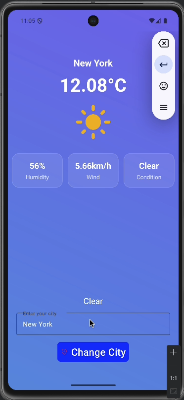
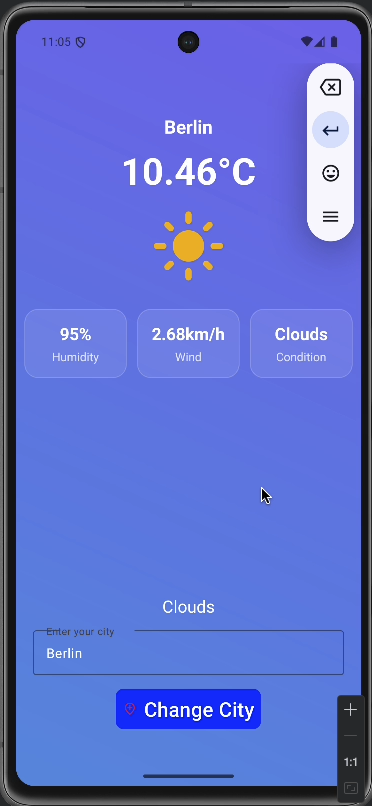
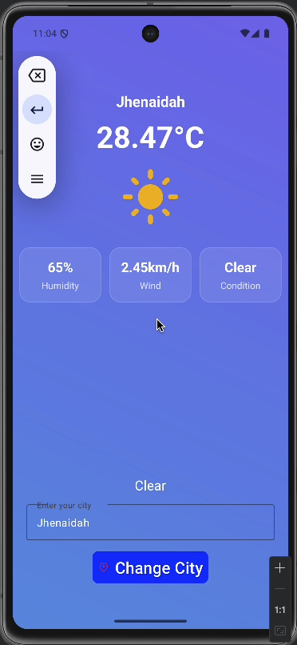

# 🌤️ Weather App

A beautiful and intuitive Android weather application built with Kotlin that provides real-time weather information for cities worldwide.


## 📱 Features

- **Real-time Weather Data**: Get current weather conditions for any city
- **Detailed Weather Information**:
  - Current temperature in Celsius
  - Humidity percentage
  - Wind speed
  - Weather condition description
- **Beautiful UI**: Modern glassmorphism design with gradient backgrounds
- **City Search**: Easy-to-use interface to search weather by city name
- **Weather Icons**: Visual representation of current weather conditions
- **Error Handling**: Graceful error messages for network issues or invalid cities
- **Loading States**: Progress indicator while fetching weather data

## 📸 Screenshots

<!-- Add your app screenshots here -->

```
| Home Screen | Search | Weather Details |
|------------|--------|----------------|
|  |  |  |
```

## 🛠️ Tech Stack

- **Language**: Kotlin
- **UI Components**:
  - Material Design Components
  - Custom XML Layouts
  - LinearLayout
- **Architecture**: MVVM (Model-View-ViewModel)
- **Networking**:
  - Retrofit / OkHttp (for API calls)
  - Coroutines (for asynchronous operations)
- **API**: OpenWeatherMap API / WeatherAPI
- **Image Loading**: Glide / Picasso

## 📋 Prerequisites

- Android Studio Arctic Fox or later
- Minimum SDK: API 21 (Android 5.0 Lollipop)
- Target SDK: API 34 (Android 14)
- Kotlin version 1.9+

## 🚀 Getting Started

### 1. Clone the Repository

```bash
git clone https://github.com/yourusername/weather-app.git
cd weather-app
```

### 2. Get API Key

1. Sign up at [OpenWeatherMap](https://openweathermap.org/api) or your preferred weather API provider
2. Generate your API key
3. Create a `local.properties` file in the root directory (if not exists)
4. Add your API key:

```properties
WEATHER_API_KEY=your_api_key_here
```

### 3. Build Configuration

Update your `build.gradle` file to read the API key:

```gradle
android {
    ...
    buildTypes {
        debug {
            buildConfigField "String", "API_KEY", "\"${project.findProperty('WEATHER_API_KEY')}\""
        }
        release {
            buildConfigField "String", "API_KEY", "\"${project.findProperty('WEATHER_API_KEY')}\""
        }
    }
}
```

### 4. Build and Run

1. Open the project in Android Studio
2. Sync Gradle files
3. Run the app on an emulator or physical device

## 📦 Dependencies

Add these dependencies to your `build.gradle` file:

```gradle
dependencies {
    // Material Design
    implementation 'com.google.android.material:material:1.11.0'

    // Retrofit for API calls
    implementation 'com.squareup.retrofit2:retrofit:2.9.0'
    implementation 'com.squareup.retrofit2:converter-gson:2.9.0'

    // Coroutines
    implementation 'org.jetbrains.kotlinx:kotlinx-coroutines-android:1.7.3'
    implementation 'org.jetbrains.kotlinx:kotlinx-coroutines-core:1.7.3'

    // ViewModel and LiveData
    implementation 'androidx.lifecycle:lifecycle-viewmodel-ktx:2.7.0'
    implementation 'androidx.lifecycle:lifecycle-livedata-ktx:2.7.0'

    // Image Loading
    implementation 'com.github.bumptech.glide:glide:4.16.0'

    // Core Android
    implementation 'androidx.core:core-ktx:1.12.0'
    implementation 'androidx.appcompat:appcompat:1.6.1'
    implementation 'androidx.constraintlayout:constraintlayout:2.1.4'
}
```

## 🎨 UI Components

### Custom Background Shape

The app uses a custom drawable for weather detail cards:

**`res/drawable/weather_detail_bg.xml`**:

```xml
<?xml version="1.0" encoding="utf-8"?>
<shape xmlns:android="http://schemas.android.com/apk/res/android"
    android:shape="rectangle">
    <solid android:color="#1AFFFFFF" />
    <corners android:radius="16dp" />
    <stroke
        android:width="1dp"
        android:color="#33FFFFFF" />
</shape>
```

## 📱 App Structure

```
app/
├── src/
│   ├── main/
│   │   ├── java/com/yourpackage/weatherapp/
│   │   │   │   └── WeatherResponse.kt
│   │   │   │   ├── WeatherApiService.kt
│   │   │   │   └── RetrofitClient.kt
│   │   │   │   └── MainActivity.kt
│   │   ├── res/
│   │   │   ├── drawable/
│   │   │   │   └── background.xml
│   │   │   │   └── location.xml
│   │   │   │   └── weather_background.xml
│   │   │   │   └── weather_detail_bg.xml
│   │   │   ├── layout/
│   │   │   │   └── activity_main.xml
│   │   │   ├── drawable/
│   │   │   │   ├── weather_background.xml
│   │   │   │   ├── weather_detail_bg.xml
│   │   │   │   ├── sunny.xml
│   │   │   │   └── location.xml
│   │   │   └── values/
│   │   │       ├── colors.xml
│   │   │       ├── strings.xml
│   │   │       └── themes.xml
│   │   └── AndroidManifest.xml
```

## 🔑 Key Features Explained

### Weather Data Display

- **Temperature**: Shows current temperature in Celsius
- **Humidity**: Displays humidity percentage
- **Wind Speed**: Shows wind speed in km/h
- **Condition**: Current weather condition (Cloudy, Sunny, Rainy, etc.)

### City Search

- Users can enter any city name
- Real-time API call fetches weather data
- Error handling for invalid city names

### UI/UX Features

- Glassmorphism design with semi-transparent cards
- Gradient backgrounds for modern look
- Material Design components
- Responsive layout for different screen sizes

## 🌐 API Integration

The app uses a weather API to fetch real-time data. Example API endpoint:

```
https://api.openweathermap.org/data/2.5/weather?q={city}&appid={API_KEY}&units=metric
```

### Sample Response:

```json
{
  "main": {
    "temp": 3.05,
    "humidity": 82
  },
  "wind": {
    "speed": 4.63
  },
  "weather": [
    {
      "main": "Clouds",
      "description": "overcast clouds"
    }
  ],
  "name": "Dhaka"
}
```

## 🐛 Known Issues

- [ ] Add support for weather forecast (5-day)
- [ ] Implement location-based weather detection
- [ ] Add dark mode support
- [ ] Cache weather data for offline viewing

## 🤝 Contributing

Contributions are welcome! Please follow these steps:

1. Fork the repository
2. Create a new branch (`git checkout -b feature/AmazingFeature`)
3. Commit your changes (`git commit -m 'Add some AmazingFeature'`)
4. Push to the branch (`git push origin feature/AmazingFeature`)
5. Open a Pull Request

## 📄 License

This project is licensed under the MIT License - see the [LICENSE](LICENSE) file for details.

## 👨‍💻 Author

**Your Name**

- GitHub: [@yourusername](https://github.com/yourusername)
- LinkedIn: [Your LinkedIn](https://linkedin.com/in/yourprofile)
- Email: your.email@example.com

## 🙏 Acknowledgments

- [OpenWeatherMap](https://openweathermap.org/) for providing the weather API
- [Material Design](https://material.io/) for design guidelines
- Android community for helpful resources

## 📞 Support

If you have any questions or need help, feel free to:

- Open an issue on GitHub
- Contact me via email
- Check out the [Wiki](https://github.com/yourusername/weather-app/wiki)

---

⭐ If you found this project helpful, please give it a star!

**Made with ❤️ and Kotlin**
